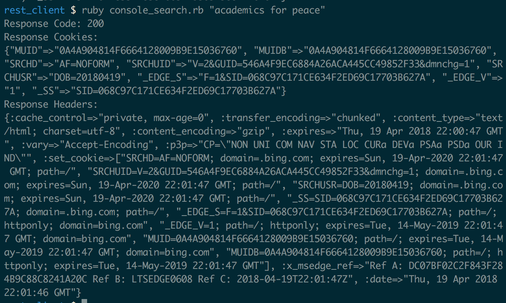

This is a project to do a Bing search in console by using rest-client gem. You can see the documentation from [here](https://github.com/rest-client/rest-client).

An example when runs in the console:

